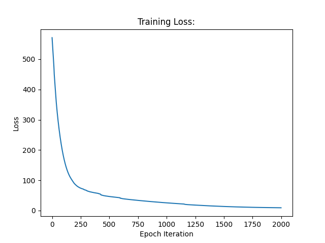
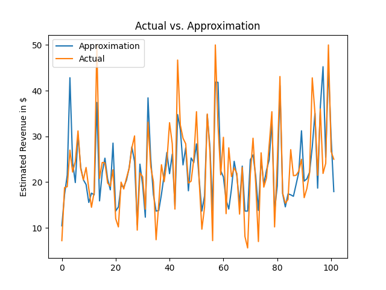

## Boston Housing Regression:
In this repository, a simple Tensorflow model was created using Tensorflow 1.14.0. This model was applied to a relatively small housing dataset. I tackled this project to enhance my versatility with respect to the platforms that I use to analyze data. This repository will serve as a benchmark for future data analysis projects. The training and testing functions are easy to replicate. 

## Dataset Description:
The dataset has 13 features and a single regressional output. The output represents the price of the house affiliated with that particular data entry. The produced model is a weak model given that the dataset has less than 1000 entries. Once again, the purpose of this project was to create a benchmark for future work. 

## Model:
A relatively simple 2 layer model was created. This model and it's parameters are illustrated by the code snippet below:

```py
learning_rate = 0.001
num_epochs = 2000
num_models = 10
batch_size = 64

hidden_layer_1 = 32
hidden_layer_2 = 1

# Placeholder for batch of inputs:
x = tf.placeholder(tf.float32, [None, input_nodes])
# Layer 1 variables:
W1 = tf.Variable(tf.truncated_normal([input_nodes, hidden_layer_1], stddev=0.15))
b1 = tf.Variable(tf.zeros([hidden_layer_1]))
y1 = tf.math.sigmoid(tf.matmul(x, W1) + b1)
# layer 2 variables:
W2 = tf.Variable(tf.truncated_normal([hidden_layer_1, hidden_layer_2], stddev=0.15))
b2 = tf.Variable(tf.zeros([hidden_layer_2]))
y = tf.matmul(y1, W2) + b2
# Placeholder for batch of targets:
y_ = tf.placeholder(tf.float32, [None, 1])
```

## Results:
The application of this model to the dataset resulted in the following training curve:



*Figure 1: The loss curve associated with the training process*

As illustrated by the above curve, the training process was smooth and gradual. There was no instability and the loss monotonically decreased. 

The curve below delineates the quality of the model during testing:



*Figure 2: The approximated fit overlayed upon the actual data*

Given the limited data, the failure of the model was expected, and has been configrmed by the above Figure. Many peaks and valleys were completed dismissed by the fit. Despite this, the model clearly demonstrated its capability to generally approximate the data. 